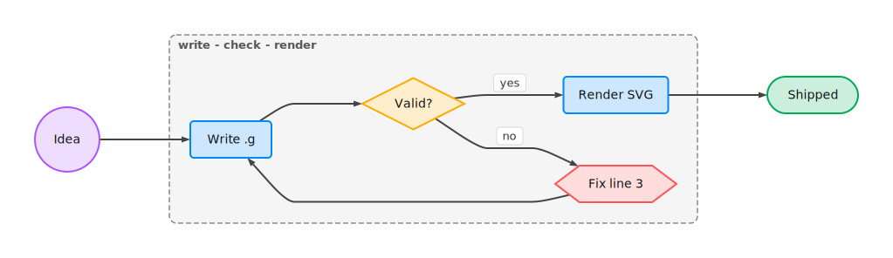
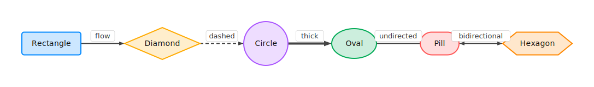
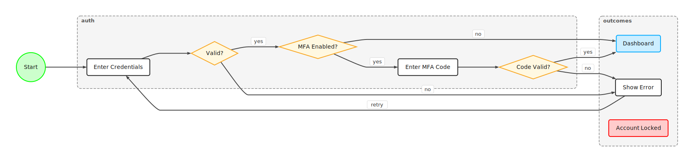
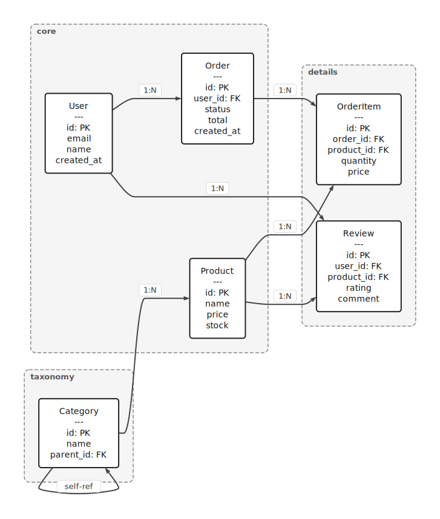
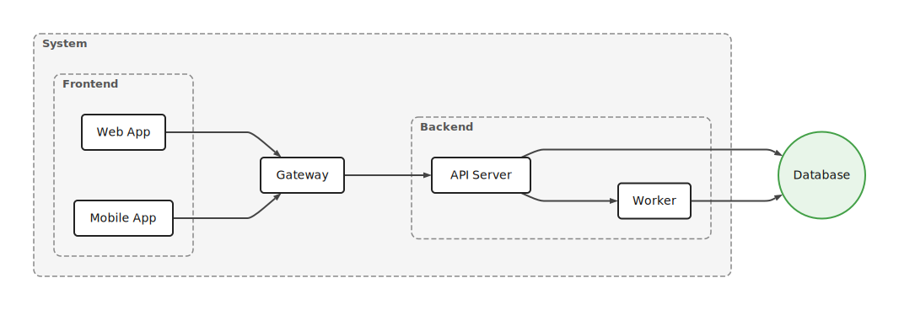
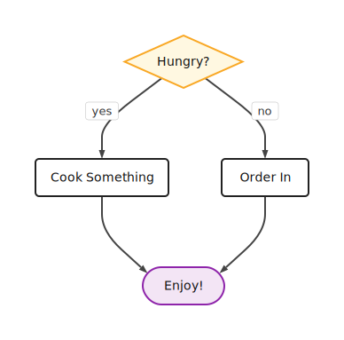
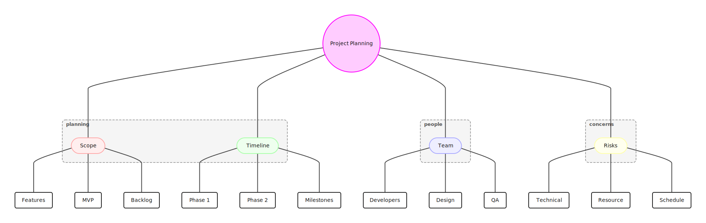

<h1 align="center">Glypho</h1>
<p align="center">
  The shortest way to write diagrams as text.
</p>

<p align="center">
  <a href="https://glypho.dev">Website</a> ·
  <a href="https://glypho.dev/editor/">Editor</a> ·
  <a href="spec/specification.md">Specification</a> ·
  <a href="https://www.npmjs.com/package/glypho">npm</a>
</p>

<p align="center">
  <a href="https://www.npmjs.com/package/glypho"></a>
  <a href="https://www.npmjs.com/package/@glypho/parser"></a>
  <a href="https://www.npmjs.com/package/@glypho/renderer"></a>
  <a href="https://www.npmjs.com/package/@glypho/cli"></a>
  <a href="https://github.com/glypho-dev/glypho/actions/workflows/ci.yml"></a>
  <a href="LICENSE"></a>
</p>

<p align="center">
  
</p>
<p align="center">
  <sub>Drawn by <a href="assets/readme-hero.g">14 lines of <code>.g</code></a> — 102 tokens where JSON Canvas needs 580.</sub>
</p>

---

Glypho (`.g` format) is a compact text notation for diagrams. You describe nodes and connections in a few short lines, and Glypho renders them as SVG. Think of it like Mermaid, but radically shorter — single-character operators, one-line-per-thing, designed from the ground up for LLMs.

---

## See It in Action

A few lines of `.g`:

```
>LR

wake:c "Wake Up"
coffee:r "Make Coffee"
ready:d "Running Late?"
rush:r "Skip Breakfast"
eat:r "Eat Breakfast"
go:p "Head Out"

wake>coffee
coffee>ready
ready>rush yes
ready>eat no
rush>go
eat>go
```

Produces:

<p align="center">
  
</p>

Every node is `id:shape Label`. Every connection is `source>target`. That's the whole idea.

Here's what that looks like compared to Mermaid:

<table>
<tr>
<th>Mermaid (11 lines)</th>
<th>Glypho (8 lines)</th>
</tr>
<tr>
<td>

```
flowchart LR
    idea(("Idea"))
    plan["Plan"]
    build["Build"]
    test{"Ready?"}
    ship(["Ship"])
    idea --> plan
    plan --> build
    build --> test
    test -- yes --> ship
    test -- no --> plan
```

</td>
<td>

```
>LR
idea:c Idea
plan:r Plan
build:r Build
test:d Ready?
ship:p Ship
idea>plan>build>test
test>ship yes
test>plan no
```

</td>
</tr>
</table>

Same diagram. Fewer characters, fewer tokens, no brackets, no keywords.

---

## Why .g?

The `.g` format was designed to use as few tokens as possible. Early comparisons against other formats representing the same graphs show significant savings:

| Format | Relative Tokens |
|---|---|
| Excalidraw JSON | ~500% |
| JSON Canvas | 100% (baseline) |
| PlantUML | ~70% |
| Mermaid | ~50% |
| Graphviz DOT | ~45% |
| **Glypho (.g)** | **~20%** |

> These are rough estimates from early-stage comparisons, not formal benchmarks. The exact ratio depends on the diagram. The point is directional: `.g` is meaningfully more compact than alternatives.

---

## Features

Every shape and every edge type, in one line each:

<p align="center">
  
</p>

<details>
<summary>Source (<code>.github/images/shapes-edges.g</code>)</summary>

```
>LR
a:r Rectangle #08f
b:d Diamond #fa0
c:c Circle #a5f
d:o Oval #0a5
e:p Pill #f55
f:h Hexagon #f80
a>b flow
b~c dashed
c=d thick
d--e undirected
e<>f bidirectional
```

</details>

| Category | Syntax | Description |
|----------|--------|-------------|
| **Shapes** | `r` `d` `c` `o` `p` `h` | rect, diamond, circle, oval, pill, hexagon |
| **Edges** | `>` `~` `=` `--` `<>` | flow, dashed, thick, undirected, bidirectional |
| **Labels** | `a>b "some text"` | on nodes and edges |
| **Chains** | `a>b>c>d` | four nodes, three edges, one line |
| **Groups** | `@name{a b c}` | visual containers, supports nesting |
| **Classes** | `.cls{a b}` / `$.cls{fill:#f00}` | membership + style rules |
| **Layout** | `>LR` `>TB` `>RL` `>BT` | four directions |
| **Positions** | `node@x,y^wxh` | explicit placement and sizing |
| **Styles** | `$:r{fill:#fff}` | CSS-like, per-shape/class/node |
| **Converters** | Mermaid, DOT, JSON Canvas | import and export |

See the [full specification](spec/specification.md) for details on every feature.

---

## Gallery

Everything below is auto-laid-out from plain `.g` text — click a caption to see the source.

<p align="center">
  
</p>
<p align="center"><sub>Login flow with groups and decisions — <a href="spec/examples/flowchart.g">flowchart.g</a></sub></p>

<table>
<tr>
<td width="42%" align="center" valign="top">
  <br>
  <sub>Entities with multiline labels — <a href="spec/examples/erd.g">erd.g</a></sub>
</td>
<td width="58%" align="center" valign="top">
  <br>
  <sub>Nested groups — <a href="spec/examples/nested-groups.g">nested-groups.g</a></sub>
  <br><br>
  <br>
  <sub>Four-line decision — <a href="spec/examples/hungry.g">hungry.g</a></sub>
</td>
</tr>
</table>

<p align="center">
  
</p>
<p align="center"><sub>Mind map with undirected edges — <a href="spec/examples/mindmap.g">mindmap.g</a></sub></p>

---

## Relation to Mermaid

Glypho focuses on the **flowchart** subset of what Mermaid offers — nodes, edges, subgraphs, and styling. It's not a replacement for Mermaid's sequence diagrams, ER diagrams, gantt charts, or other specialized diagram types.

- Mermaid flowchart import/export covers: direction, nodes/shapes, edges/labels/chains, subgraphs, `style`, `classDef`, and `class`
- Unsupported Mermaid constructs are surfaced as parse errors, not silently dropped
- Other Mermaid diagram families (sequence, ER, gantt, C4, state) are out of scope

---

## Use with AI Agents

Install the Glypho skill so your AI agent can create diagrams for you:

```bash
npx skills add glypho-dev/glypho
```

Or install globally so the skill is available in all your projects:

```bash
npx skills add glypho-dev/glypho -y -g
```

Then just ask your agent things like:
- "Draw me a user registration flow"
- "Create an architecture diagram for my microservices"
- "Make a CI/CD pipeline diagram"

The skill teaches your agent the complete `.g` notation so it can write correct diagrams on the first try. Works with Claude Code, Cursor, Codex, Windsurf, and [40+ other AI agents](https://agentskills.io).

---

## For AI Agents

To generate `.g` diagrams, read these in order:
1. [Examples](spec/examples/) — learn the patterns
2. [Specification](spec/specification.md) — full syntax reference
3. [EBNF Grammar](spec/grammar.ebnf) — formal grammar

The [Features](#features) table above is a quick cheat sheet.

---

## Install

### Library — parse and render `.g` in your app

```bash
npm install glypho
```

This gives you the parser and SVG renderer. No React, no DOM, no heavy dependencies.

```typescript
import { parse, render } from 'glypho';

const { svg } = render('a:r Hello\nb:c World\na>b');
// svg is a complete SVG string — embed in HTML, write to file, serve from API
```

Need the React component? Add React as a peer:

```bash
npm install glypho react
```

```tsx
import { GlyphoGraph } from 'glypho/react';
import { parse } from 'glypho';

const { graph } = parse('a:r Hello\nb:c World\na>b');

<GlyphoGraph graph={graph} width={800} height={600} />
```

### CLI — render, validate, and convert from the terminal

```bash
npm install -g @glypho/cli    # install globally
npm update -g @glypho/cli     # update to latest
```

Or use locally without installing globally:

```bash
npm install @glypho/cli
npx glypho render flow.g -o flow.svg
```

### Batch render — convert a folder of `.g` files to SVG

```bash
for f in diagrams/*.g; do
  glypho render "$f" -o "${f%.g}.svg"
done
```

Or programmatically in a Node script:

```typescript
import { render } from 'glypho';
import { readFileSync, writeFileSync, readdirSync } from 'fs';

for (const file of readdirSync('diagrams').filter(f => f.endsWith('.g'))) {
  const { svg } = render(readFileSync(`diagrams/${file}`, 'utf8'));
  writeFileSync(`diagrams/${file.replace('.g', '.svg')}`, svg);
}
```

### Scoped packages

You can also install the individual packages directly:

```bash
npm install @glypho/parser              # parser only
npm install @glypho/renderer            # renderer only (includes parser as dependency)
npm install @glypho/parser @glypho/renderer  # both
```

---

## CLI Reference

```bash
glypho check flow.g               # validate syntax
glypho check flow.g --json        # machine-readable validation
glypho parse flow.g               # print JSON AST
glypho parse flow.g --compact     # minified JSON AST
glypho info flow.g                # stats + token comparison across formats
glypho render flow.g              # render to SVG (writes flow.svg)
glypho render flow.g -o out.svg   # render to a specific path
glypho render flow.g -f png       # render to PNG
glypho render flow.g -f png --scale 2  # render @2x PNG
glypho render flow.g -b white     # render with background color
glypho render flow.mmd            # render Mermaid file to SVG
glypho render graph.dot           # render DOT file to SVG
glypho preview out.svg            # open SVG in browser
glypho to mermaid flow.g          # convert .g to Mermaid
glypho from mermaid flow.mmd      # convert Mermaid to .g
glypho from dot graph.dot         # convert Graphviz DOT to .g
```

PNG export supports CJK and other non-Latin scripts. Emoji are a known limitation: the rasterizer (resvg) has no color-font support, and an emoji in a label currently breaks that label's whole text run in the PNG output. Use SVG output when labels contain emoji.

All commands except `preview` accept `-` for stdin or read from stdin when input is piped (`preview` requires an existing `.svg` file). See the [CLI README](packages/cli/README.md) for full details.

---

## Packages

| Package | Description |
|---------|-------------|
| [`@glypho/parser`](packages/parser/) | Lexer + recursive descent parser, AST types, serializers, Mermaid/DOT converters |
| [`@glypho/renderer`](packages/renderer/) | Layout engine, pure SVG renderer, React component |
| [`@glypho/cli`](packages/cli/) | CLI tool for validation, rendering, and format conversion |
| [`glypho`](packages/glypho/) | Umbrella package: one install for parser + renderer |

---

## Develop From Source

```bash
git clone https://github.com/glypho-dev/glypho.git && cd glypho
npm install
npm run build
npm test
```

Build order matters (parser → renderer → cli → glypho). `npm run build` handles this automatically.

---

## Spec and Docs

- [Full Specification](spec/specification.md)
- [EBNF Grammar](spec/grammar.ebnf)
- [Examples](spec/examples/)
- [Publishing Policy](PUBLISHING.md)
- [Contributing](CONTRIBUTING.md)
- [Changelog](CHANGELOG.md)

---

## License

MIT
