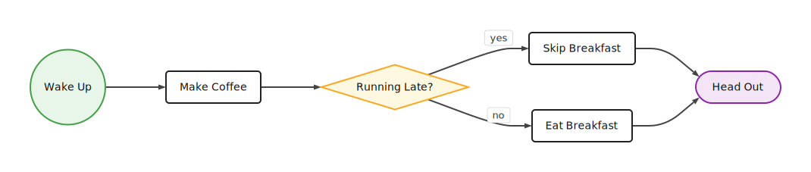
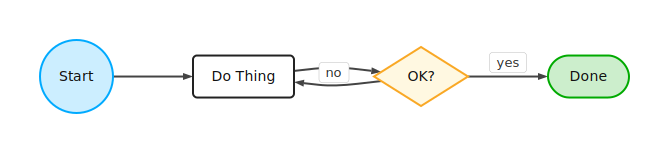
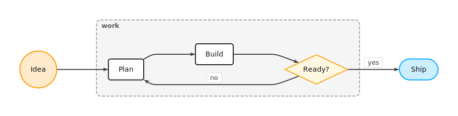
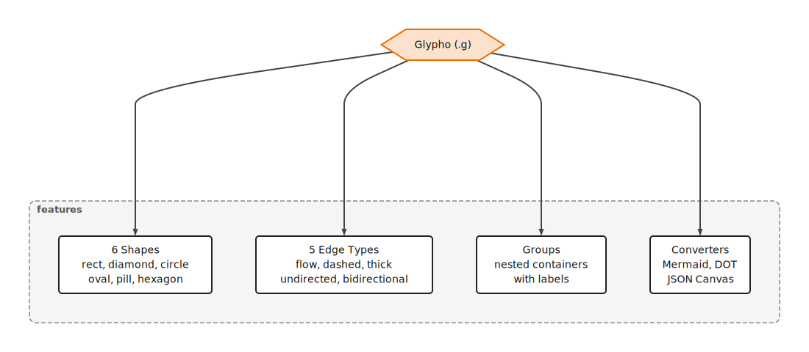

<h1 align="center">Glypho</h1>
<p align="center">
  The shortest way to write flowcharts as text.
</p>

<p align="center">
  <a href="https://www.npmjs.com/package/@glypho/parser"></a>
  <a href="https://www.npmjs.com/package/@glypho/renderer"></a>
  <a href="https://www.npmjs.com/package/@glypho/cli"></a>
  <a href="https://github.com/glypho-dev/glypho/actions/workflows/ci.yml"></a>
  <a href="LICENSE"></a>
</p>

---

## What is Glypho?

Glypho (`.g` format) is a compact text notation for flowcharts and diagrams. You describe nodes and connections in a few short lines, and Glypho renders them as SVG.

Think of it like Mermaid, but radically shorter. Where other formats need verbose syntax, keywords, and brackets, `.g` uses single-character operators and one-line-per-thing simplicity. It was designed from the ground up for LLMs — small enough to fit in prompts, regular enough for AI to generate correctly, and expressive enough for real diagrams.

**Use it to:**
- Turn quick ideas into visual flowcharts
- Let LLMs generate diagrams without burning through your token budget
- Convert existing Mermaid or Graphviz diagrams to a more compact form
- Embed diagram rendering in your apps (pure SVG, no DOM needed)

---

## See It in Action

A few lines of `.g`:

```
>LR

wake:c "Wake Up"
coffee:r "Make Coffee"
ready:d "Running Late?"
rush:r "Skip Breakfast"
eat:r "Eat Breakfast"
go:p "Head Out"

wake>coffee
coffee>ready
ready>rush yes
ready>eat no
rush>go
eat>go
```

Produces:

<p align="center">
  
</p>

Every node is `id:shape Label`. Every connection is `source>target`. That's the whole idea.

---

Here's another — a simple process with a decision loop:

```
>LR

start:c Start
process:r "Do Thing"
check:d OK?
done:p Done

start>process
process>check
check>done yes
check>process no
```

<p align="center">
  
</p>

And a project flow with groups:

```
>LR

idea:c Idea
plan:r Plan
build:r Build
test:d Ready?
ship:p Ship

@work{plan build test}

idea>plan
plan>build
build>test
test>ship yes
test>plan no
```

<p align="center">
  
</p>

---

## Why .g?

The `.g` format was designed to use as few tokens as possible. Early comparisons against other formats representing the same graphs show significant savings:

| Format | Relative Tokens |
|---|---|
| Excalidraw JSON | ~500% |
| JSON Canvas | 100% (baseline) |
| PlantUML | ~70% |
| Mermaid | ~50% |
| Graphviz DOT | ~45% |
| **Glypho (.g)** | **~20%** |

> These are rough estimates from early-stage comparisons, not formal benchmarks. The exact ratio depends on the diagram. The point is directional: `.g` is meaningfully more compact than alternatives.

Here's the same diagram in Mermaid vs `.g`:

<table>
<tr>
<th>Mermaid (11 lines)</th>
<th>Glypho (8 lines)</th>
</tr>
<tr>
<td>

```
flowchart LR
    idea(("Idea"))
    plan["Plan"]
    build["Build"]
    test{"Ready?"}
    ship(["Ship"])
    idea --> plan
    plan --> build
    build --> test
    test -- yes --> ship
    test -- no --> plan
```

</td>
<td>

```
>LR
idea:c Idea
plan:r Plan
build:r Build
test:d Ready?
ship:p Ship
idea>plan>build>test
test>ship yes
test>plan no
```

</td>
</tr>
</table>

Same diagram. Fewer characters, fewer tokens, no brackets, no keywords.

---

## Features

<p align="center">
  
</p>

| Category | Syntax | Description |
|----------|--------|-------------|
| **Shapes** | `r` `d` `c` `o` `p` `h` | rect, diamond, circle, oval, pill, hexagon |
| **Edges** | `>` `~` `=` `--` `<>` | flow, dashed, thick, undirected, bidirectional |
| **Labels** | `a>b "some text"` | on nodes and edges |
| **Chains** | `a>b>c>d` | four nodes, three edges, one line |
| **Groups** | `@name{a b c}` | visual containers, supports nesting |
| **Classes** | `.cls{a b}` / `$.cls{fill:#f00}` | membership + style rules |
| **Layout** | `>LR` `>TB` `>RL` `>BT` | four directions |
| **Positions** | `node@x,y^wxh` | explicit placement and sizing |
| **Styles** | `$:r{fill:#fff}` | CSS-like, per-shape/class/node |
| **Converters** | Mermaid, DOT, JSON Canvas | import and export |

---

## Relation to Mermaid

Glypho focuses on the **flowchart** subset of what Mermaid offers — nodes, edges, subgraphs, and styling. It's not a replacement for Mermaid's sequence diagrams, ER diagrams, gantt charts, or other specialized diagram types.

- Mermaid flowchart import/export covers: direction, nodes/shapes, edges/labels/chains, subgraphs, `style`, `classDef`, and `class`
- Unsupported Mermaid constructs are surfaced as parse errors, not silently dropped
- Other Mermaid diagram families (sequence, ER, gantt, C4, state) are out of scope

---

## Install

```bash
npm install @glypho/parser @glypho/renderer
```

For the CLI:

```bash
npm install -g @glypho/cli
```

---

## Usage

### Parse `.g` input

```typescript
import { parse } from '@glypho/parser';

const { graph, errors } = parse(`
>LR
a:r "Start"
b:r "End"
a>b success
`);
// graph.nodes, graph.edges, graph.groups, graph.positions, graph.styles
// errors[] for any parse issues (parser recovers and continues)
```

### Render SVG (no React needed)

```typescript
import { render } from '@glypho/renderer/svg';

const { svg, errors } = render(`a:r Hello\nb:c World\na>b`);
// svg is a complete SVG string — write to file, serve from API, etc.
```

### React component

```tsx
import { parse } from '@glypho/parser';
import { GlyphoGraph } from '@glypho/renderer';

const { graph } = parse(`a:r Hello\nb:c World\na>b`);

<GlyphoGraph
  graph={graph}
  width={800}
  height={600}
  onNodeClick={(id) => console.log(id)}
/>
```

### CLI

```bash
glypho check flow.g               # validate syntax
glypho check flow.g --json        # machine-readable validation
glypho parse flow.g               # print JSON AST
glypho parse flow.g --compact     # minified JSON AST
glypho info flow.g                # stats + token comparison across formats
glypho render flow.g              # render to SVG (stdout path)
glypho render flow.g -o out.svg   # render to SVG file
glypho render flow.g -f png       # render to PNG
glypho preview out.svg            # open SVG in browser
glypho to mermaid flow.g          # convert .g to Mermaid
glypho from mermaid flow.mmd      # convert Mermaid to .g
glypho from dot graph.dot         # convert Graphviz DOT to .g
```

All commands accept `-` for stdin or read from stdin when input is piped. See the [CLI README](packages/cli/README.md) for full details.

---

## Packages

| Package | Description |
|---------|-------------|
| [`@glypho/parser`](packages/parser/) | Lexer + recursive descent parser, AST types, serializers, Mermaid/DOT converters |
| [`@glypho/renderer`](packages/renderer/) | Layout engine, pure SVG renderer, React component |
| [`@glypho/cli`](packages/cli/) | CLI tool for validation, rendering, and format conversion |

---

## Develop From Source

```bash
git clone https://github.com/glypho-dev/glypho.git && cd glypho
npm install
npm run build
npm test
```

Build order matters (parser → renderer → cli). `npm run build` handles this automatically.

---

## Editor

The editor/playground lives in a separate repo and is available deployed at [editor.glypho.dev](https://editor.glypho.dev).

---

## Spec and Docs

- [Full Specification](spec/specification.md)
- [EBNF Grammar](spec/grammar.ebnf)
- [Examples](spec/examples/)
- [Publishing Policy](PUBLISHING.md)
- [Contributing](CONTRIBUTING.md)
- [Changelog](CHANGELOG.md)

---

## License

MIT
